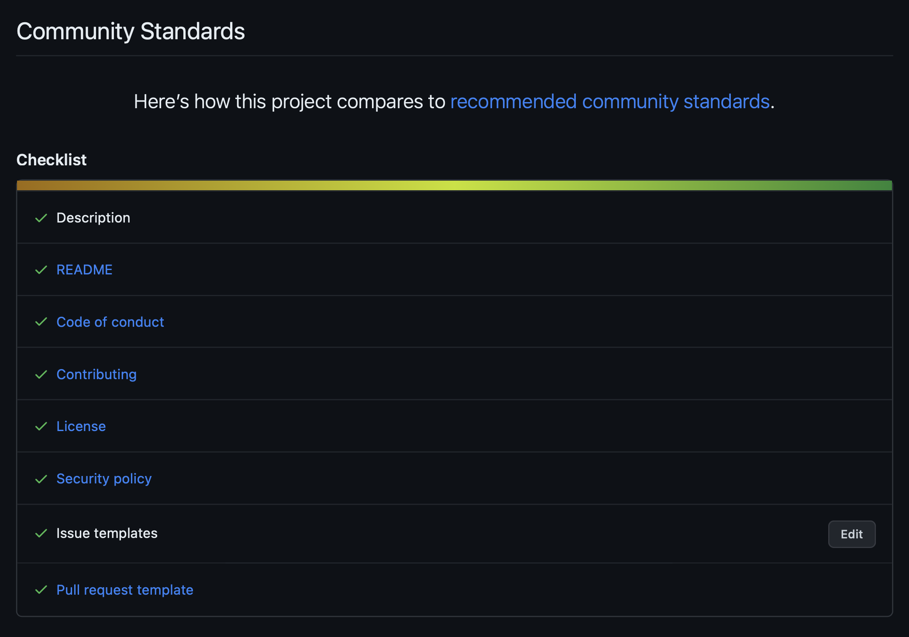

# {{ Project Name }}

{{ Description }}

## ✨ Features

- TODO

## 📋 Requirements

- [TODO](TODO)

## 🏁 Getting Started

TODO

## 🔧 Installation

TODO

## 🔄 Updating / Upgrading

TODO

## 📝 Usage

TODO

## ❓ Getting Help

TODO

## 🤝🏽 Contributing

If you want to contribute to this project and make it better, your help is very
welcome.

For more information, see [Contributing Guide](https://github.com/erdaltsksn/.github/blob/main/CONTRIBUTING.md).

## 🔒 Security Policy

If you discover a security vulnerability within this project, please follow our
[Security Policy](https://github.com/erdaltsksn/.github/blob/main/SECURITY.md).

## 📜 Code of Conduct

This project adheres to the Contributor Covenant [Code of Conduct](https://github.com/erdaltsksn/.github/blob/main/CODE_OF_CONDUCT.md).
By participating, you are expected to uphold this code.

## ⚠️ Disclaimer

In no event shall we be liable to you or any third parties for any special,
punitive, incidental, indirect or consequential damages of any kind, or any
damages whatsoever, including, without limitation, those resulting from loss of
use, data or profits, and on any theory of liability, arising out of or in
connection with the use of this software.
